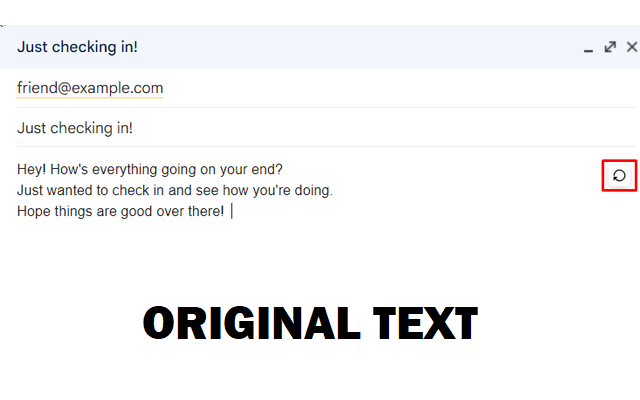
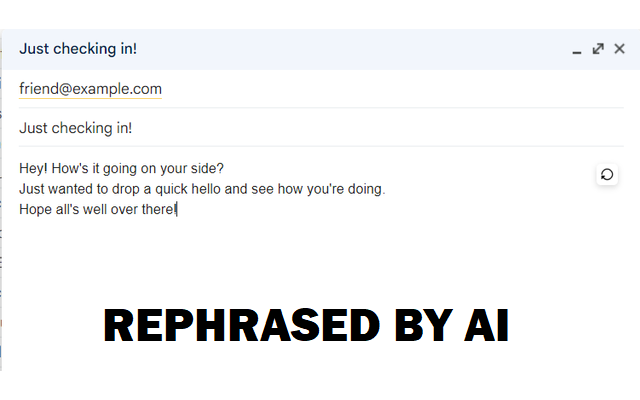
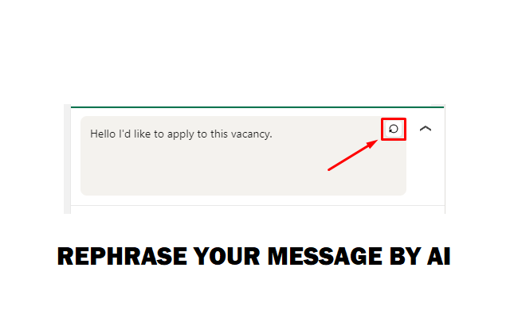
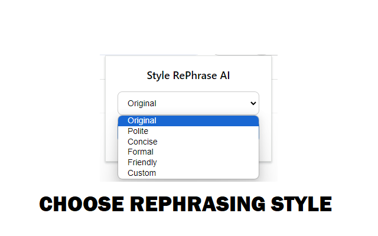

# RePhrase AI ✨

RePhrase AI is a lightweight and privacy-friendly Chrome extension that helps you rewrite text in different styles using artificial intelligence — directly in your browser.

## 🚀 Features

- 🧠 Instantly rephrase what you write in any text field or contenteditable area
- 🎯 Choose from multiple styles: Formal, Friendly, Concise, Polite, or Custom
- 🌍 Automatically adapts to your browser language (English, Russian, Spanish)
- 🔐 No account or API key needed — works out of the box
- ⚡ Minimalistic and fast — designed to stay out of your way
- 🛡 Does **not** collect or store any personal data

## 🧩 How It Works

1. Write your text anywhere on the web.
2. Click the RePhrase AI icon 🔁 next to the input field.
3. Watch your text transform into the selected tone or style — instantly.

> The original meaning and language are always preserved.

## 🖼 Screenshots

<!--  -->
<!--  -->
<!--  -->
<!--  -->

## 🔐 Privacy

RePhrase AI does **not** track, collect, or transmit any user data.  
Text is sent securely to the OpenRouter AI service only for the purpose of rephrasing.  
See the [Privacy Policy](./privacy-policy.md) for full details.

## 📦 Installation (TO DO)

1. Install from the [Chrome Web Store](https://chrome.google.com/webstore/detail/rephrase-ai/...) (coming soon)
2. Or clone this repo and load it via `chrome://extensions` in Developer Mode.

## 🧪 Local Development

To test locally:

1. Clone the repo  
2. Open `chrome://extensions`  
3. Enable **Developer Mode**  
4. Click **Load unpacked** → select the folder  
5. Use on any webpage with text fields

## 📄 License

MIT License — see [LICENSE](./LICENSE)
